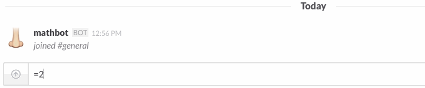
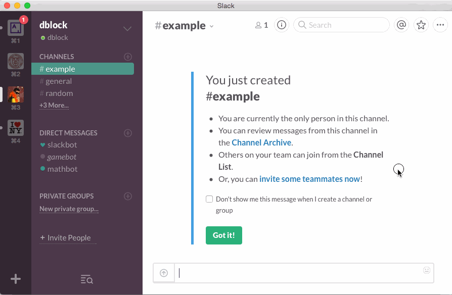

Slack-Mathbot
=============

A math bot for Slack. Math is good for you.

## Installation

See [DEPLOYMENT](DEPLOYMENT.md).

## Usage

Invite your bot to a channel. Do math by starting a message with an equal sign.

### Commands

#### mathbot calculate [expression]

Calculates an expression, currently just basic math. See [Dentaku](https://github.com/rubysolo/dentaku) for what's supported.

#### mathbot

Shows MathBot version and links.

#### mathbot hi

Politely says 'hi' back.

#### mathbot help

Get help.

## Contributing

See [CONTRIBUTING](CONTRIBUTING.md).

## Copyright and License

Copyright (c) 2015, Daniel Doubrovkine, Artsy and [Contributors](CHANGELOG.md).

This project is licensed under the [MIT License](LICENSE.md).
